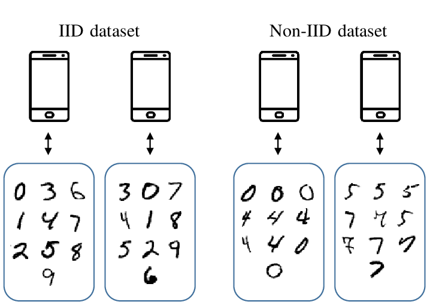

# Federated Learning (FL)

In this repository, we will have hands-on experience with flower.ai framework for NLP.

Let's get started!

If you do not want to dive deep into this readme, the bottom line is as follows
* Centralized (traditional) machine learning: Move the data to the computation
* Federated machine learning: Move the computation to the data
As we deploy Federated Learning, we discover more and more areas that can suddenly be reinvented because they now
have access to vast amounts of previously inaccessible data.

**How does federated machine learning works?**
1. **Step0:** Initialize the model on the server. This is exactly the same in classic centralized learning.
2. **Step1:** Send model to a number of connected client nodes.
3. **Step2:** Train model locally on the data of each client nodes.

   *They don’t train the model until full convergence, but they only train for a little while. This could be
    as little as one epoch on the local data, or even just a few mini-batches.*
4. **Step3:** Return model updates back to the server. The model updates could be either the full parameters or just the gradients.
5. **Step4:** Aggregate model updates into new global model.
   
    *The most basic way is Federated Averaging[2]. To be more precise, it takes the weighted average of the model
     updates, **weighted by the number of examples** each client used for training.*
6. **Step5:** Repeat steps 1-4 until the model converges.

    *We then have to repeat this training process over and over again to eventually arrive at a fully trained model
     that performs well across the data of all client nodes.*

**Feredated Evaluation:** We evaluate the model on clients' data and receive metrics.

**Privacy:** We ensure the privacy of individual participants with **differential privacy** by adding statistical noise
to the model updates. Hence, any individual participants' information can not be distinguished or re-identified.

**Interesting Questions**

- How can we select the best client nodes that should participate in the next round?
- What’s the best way to aggregate model updates?
- How can we handle failing client nodes (stragglers)?

**Useful Information**

---
### References
1. [Flower.ai documentation](https://flower.ai/docs/framework/tutorial-series-what-is-federated-learning.html)
2. [Communication-Efficient Learning of Deep Networks from Decentralized Data](https://arxiv.org/abs/1602.05629)
3. 
